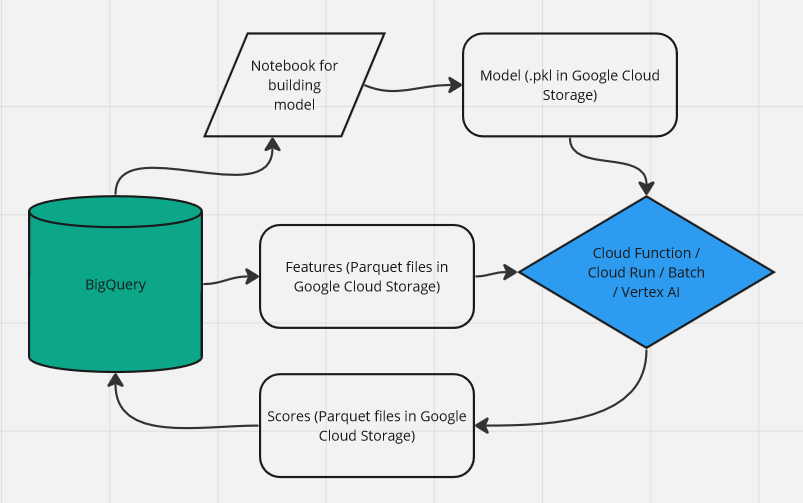

This GitHub describes how to quickly turn arbitary model code into a production pipeline for scoring batch tabular data. It creates a model from a publicly available dataset on BigQuery, 'natality-data' to predict the weight of a baby from some clinical factors of the parents and child, then scores it using GCP resources.

This entire scoring pipeline runs in less than ten minutes, scoring ~140M rows, and cost is on the order of cents. Time could be further brought down using parallel HTTP calls to the Cloud Function, or using parallelization on Cloud Run / Vertex / Batch / Vertex AI.

Reaons to do this:
- you have data in a database and some model scoring code, and you want to populate another table with results
- you have access to GCP resources
- you want to minimize costs using serverless resources (this whole pipeline is less than 2 or 3 dollars to run)
- you want to rely on managed resources to avoid additional DevOps work

Requirements:
1. A GCP account
2. gcloud on the command line
3. Docker, on the command line

Steps:
1. Get a BigQuery dataset, and build a model from a sample of it. you can export data to GCS or with a sample query.
2. Save a model in GCS. There's a notebook in this folder (Natality Model.ipynb) with some examples.
3. For scoring, there are a few options. For simplicity, I created a Cloud Function (cloud_function.py, called with submit_request.sh) that scores each file on GCS and puts it out into an output file. Other options are Vertex UI batch scoring job (https://cloud.google.com/vertex-ai/docs/python-sdk/prediction-classes) or Cloud Run. Cloud Run is better if scoring each file takes over 9-10 minutes or if your model is in a language not supported by Cloud Functions, like R. You'll have to Dockerize your scoring code- an example is in the cloud_run folder in this project.
4. Collecting the output parquet files into a BigQuery table is in load_scores.sh. There's a commented out line for creating the table- the schema is inferred from the parquet files.

